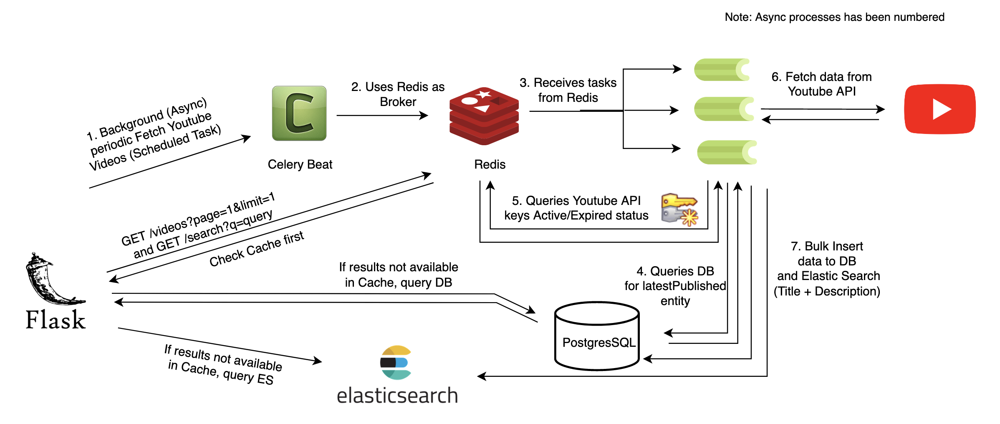

# Youtube Fetch API

API to get latest videos of certain topic from Youtube (fetched from the Youtube Data API) 

## Design



## Tech Stack

- Backend : Flask
- Database : PostgreSQL, Redis, Elastic Search
- Tools : Celery, Celery Beat, Docker & Docker-Compose

## Why This system is Scalable ?

- Celery is better than cron jobs because it can be easily distributed across machines with a centralised cache (like ElasticCache by AWS).
- Cache also stores exhausted keys status in multi key support to save network calls when celery is deployed on multiple instances.
- Elastic Search is the most sought open source search tool. Leverages B+ Trees indexing at its core.
- Bulk Insert in DB allows inserting large number of items In single attempt
- APIs use Cache to reduce network I/O calls when fetching data from Elastic Search or DB.
- More points below on how to optimize it further..

## Project Structure
    
    youtube_fetch         
    |
    ├── Contains
    |   └── docker-compose.yml                # Docker Compose File     
    |   ├── .gitignore                        # Gitignore file to stop tracking unnecesarry files
    │   ├── services                          
    |       ├── yt-api                        
    |           ├── Dockerfile                # Docker File
    |           ├── entrypoint.sh             # Entrypoint for Docker Container
    |           ├── requirements.txt          # Requirements file for the project
    |           ├── yt-api                    
    |               ├── project               
    |                    ├── __init__.py      # Initialization file for all services of Youtube API service
    |                    ├── .env             # Environment File
    |                    ├── celerybeat.py    # Celery Beat (Scheduler) Configuration file
    |                    ├── config.py        # Youtube service project configuration file
    |                    ├── es_utils.py      # Elastic Search Utils file
    |                    ├── models.py        # Models file for database
    |                    ├── tasks.py         # Async tasks background file
    |                    ├── utils.py         # Utilities file
    |____________________       


## Getting Started

These instructions will get you a copy of the project up and running on your local machine for development and testing purposes.

### Prerequisites

Firstly, turn the Docker Daemon on:

```
git clone https://github.com/saket13/youtube_fetch
cd youtube_fetch
chmod +x services/yt-api/entrypoint.sh
```

### Running Docker Containers, Creating DB and Elastic Search Index

``` 
docker-compose up -d --build
docker-compose exec web python manage.py create_db
docker-compose exec web python manage.py create_es_index
```

## Screenshots


**Search API:**

<p float="left">
  
</p>

**Paginated Videos API:**

|   |   |
|:---:|:---:|
| Paginated View - Page-1 | Paginated View - Page-2 |

**Containers:**

<p float="left">
  
   
</p>
| Containers | Scheduler |

### Testing

Use postman to do a GET request:

```
Query Params
URL_1 = http://127.0.0.1:5000/videos?page=1&limit=5 <br/>
URL_2 = http://127.0.0.1:5000//search?q=lanka
```
Here, params in URL-1 represent the page number and limit per page for pagination <br/>
In URL-2 query string to be searched.

## Progress

- [x] Async Worker to add latest videos every min and store in DB with index
- [x] Paginated GET API to fetch videos in descending order of published date time
- [x] Basic search API to search the stored videos using their title and description
- [x] Dockerize the Project
- [x] Multi Key Support
- [x] Optimize search API for partial search in title or description

## Further Optimizations (For this Use Case - To the best of my knowledge)

- Application Level
1. Using AsyncIO and its libraries for handling HTTP requests asynchronously using event loop and coroutines.
2. Implementing Payload Compression to save amount of data transferred.
3. Decoupling fetching of videos from Youtube API and saving to DB using Redis and Celery, like a simple Pub-Sub to scale more.
4. Using a faster runtime of Python something like JIT compiler.
5. Sharing frequently accessed memory of application instances.

- Infra Level
1. Use a load balancer and a number of instances to evenly distribute load and increase efficiency of APIs
2. Use Nginx as reverse proxy and gunicorn to manage multiple replicas of the app on same instance.
3. RDS should be centralized too and Master-slave architecture can also be used to distribute the load.
4. Redis Cluster should be used to avoid Redis failovers instead of single Redis node.
5. Using ELK stack for unified logging across the product.

And many more.......


